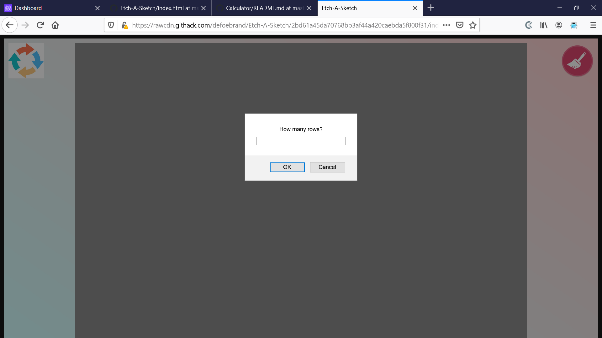

# Project Name

Microverse Pre-course work Etch-a-Sketch

Additional description about the project and its features.

This project was the first project compiled by Brandon during the Microverse Pre-course work

## Built With

- HTML, CSS, and JS
- Atom
- Ubuntu

## Live Demo

[Live Demo Link](https://rawcdn.githack.com/defoebrand/Etch-A-Sketch/2bd61a45da70768bb3af44a420caebda5f800f31/index.html)

## Video Demonstration
[Video Demonstration](https://www.loom.com/share/e9c96d17c5e5416db627ce4d8c4578f6)

This video does not show the alert prompts that will be filled in with row/column amounts or the dragged erase icon.

## Getting Started

To get your own copy of this project clone the repository to your local machine.

## Authors

👤 **Brandon Defoe**

- Github: [@defoebrand](https://github.com/defoebrand)
- Gmail: defoe.brand@gmail.com

## 🤝 Contributing

Contributions, issues and feature requests are welcome!

Feel free to check the [issues page](issues/).

## Show your support

Give a ⭐️ if you like this project!

## Future Features
- option to change colors
- interactive dials instead of using mouse

## 📝 License

This project is licensed by Microverse and The Odin Project
